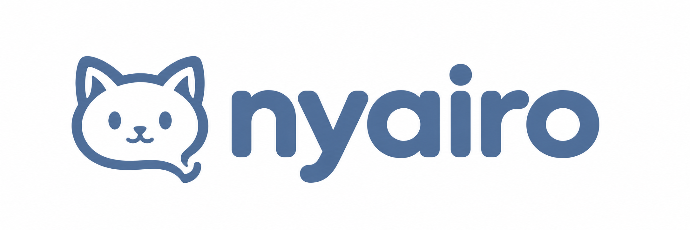

# nyairo · 数字个体框架



nyairo 探索数字个体的连续性：把对话、长期记忆、生活状态、世界与身体观察、认知判断和个人文档放在同一个框架中，让它们按明确的配置和边界配合。

项目包含已打补丁的完整 Hermes Agent 0.21.0（固定提交 `67807e64a66044db9e0a641d98c68a35c1760589`）。第一版沿用 Hermes 的命令行、工具、技能和消息网关，新增以下能力：

| 能力 | 第一版能做什么 | 使用条件与范围 |
| --- | --- | --- |
| 长期记忆 | 组织个人经历，跨会话召回，查看、纠正或停止采用记忆 | 基础配置可启用；原始聊天与审计另行管理 |
| 生活状态 | 保存入站事件、状态与审计，重启恢复，为聊天提供有限状态观察 | 基础配置可启用；没有正式活动时显示 IDLE |
| 世界与身体 | 读取有限世界中的位置、姿态与身体信号 | 需要独立 World/Body 服务；标准插件提供只读观察 |
| 认知观察 | 对明确请求给出模型判断与原因，包含预算、超时和故障保护 | 可选开启；Shadow 判断不直接执行动作 |
| 个人文档与资源 | 在个人工作空间中保存、读取独立文档 | 需要 Life Supply 服务与有限授权；通用装配仍有已知限制 |

`/chiyo_status` 查看模块实际状态，`/chiyo_consider` 提交认知观察请求，`/chiyo_note` 保存或读取文档。命令是否可用取决于相应服务和配置；安装依赖并不自动完成全部模块装配。详见 [功能与来源](FEATURES.md) 和 [第一版功能状态](https://nyairo.com/#status-matrix)。

## 从哪里开始

- [官网与完整教程](https://nyairo.com/)
- [第一次使用的安装路线](https://nyairo.com/#quickstart)
- [GitHub Releases：v0.1.0-rc6](https://github.com/L1AN929/nyairo/releases/tag/v0.1.0-rc6)
- [仓库内的中文使用教程](docs/USER_GUIDE.zh-CN.md)

Windows 用户先打开 WSL / Ubuntu；Linux 用户打开终端。在普通账号下运行这一行：

```bash
curl -fsSL https://nyairo.com/install.sh | bash
```

安装器自动准备 uv / Python、下载并校验 rc6、安装依赖和创建个人配置，再打开模型设置向导。选择模型并填写自己的连接信息后进入聊天；以后打开新终端运行 `nyairo` 即可。基础配置启用记忆与生活状态，并授权当前本地账号；模型工具默认受限，详见 [隐私修复与升级](PRIVACY_REVIEW.md)。

个人数据在 `~/.nyairo`，程序在 `~/.local/share/nyairo/releases/v0.1.0-rc6`。重复安装保留已有设置和记录，不自动升级发行版本。模型密钥仍需自己提供，其他模块与机器人按教程另外配置。

手动 Git / ZIP 安装、无人值守参数及平台准备见 [安装说明](INSTALL.md) 和 [中文教程](docs/USER_GUIDE.zh-CN.md)。原来的 `bash scripts/install.sh` 保留为源码目录内的依赖安装命令。

## 第一版的实际范围

当前公开安装标签和 Release ZIP 是 `v0.1.0-rc6` 体验候选。长期记忆、生活状态与观察能力各有自己的边界；第一版尚未开放自主活动执行、主动联系和网页聊天。网站是教程入口，聊天在程序或消息机器人中进行。

Linux / Windows WSL 的公开标签和 ZIP 有普通账号安装复核记录。Telegram 有已装配实例的收发记录；Hermes 包含其他平台适配器，不代表每个平台都已用真实账号完成同样的验收。原生 Windows、macOS、官方完整容器方案和全模块一键配置没有完成相同范围的交付。

rc5 已修复旧候选的上下文和记忆命令提示问题。Supply 双身份 socket 连接安排仍需按服务权限单独配置，见 [已知问题](KNOWN_ISSUES.md) 和 [排错教程](https://nyairo.com/#troubleshooting)。

## 框架、个体与个人数据

新实例从中性模板开始，不预置作者的名字、人格、关系、账号或历史。修改自己数据目录中的 `SOUL.md`，就能定义名字、说话方式与关系；已有的人设文件会保留。

记忆、聊天记录、配置和个人文档放在独立数据目录；按模型和平台设置，所需内容会发送给相应服务。停止召回记忆不等于删除原始聊天、审计或消息平台副本。数据与权限说明见 [隐私教程](https://nyairo.com/#privacy) 和 [安全反馈](SECURITY.md)。

历史 `/chiyo_*`、`CHIYO_*`、`chiyo_bundle` 和 `.chiyo-v1` 名称保留兼容。已发布标签和安装包保持原字节；当前主分支中的文档或代码更新，不会自动改写旧包。

## 验证与开发

历史 R17 的完整 Hermes 默认 Python 套件记录为 45,071 通过、0 失败、440 条件跳过。这属于当时对应候选的证据，不能据此宣布当前主分支零缺陷或所有平台已验证。后续公开候选复核与定向检查单独记录，详见 [验收与复测](TESTING.md) 和 [网站验收说明](https://nyairo.com/#testing)。

当前 GitHub Actions 运行的是 Pages 网站构建与部署；功能 CI 模板仍在 `ci/templates/`，尚未启用。网站发布成功与运行时功能测试是两件分别验证的工作。

`vendor/hermes/` 包含已修改的完整宿主；44 个宿主文件的前后哈希记录在 `patches/baseline.json`。不要对运行中的内置宿主执行 rollback，否则会撤掉插件所需接线。`plugins/chiyo/` 是插件，`chiyo_bundle/` 负责个人服务装配，`components/` 包含独立组件，`patches/` 记录宿主改动。更新时使用配套的 nyairo 发行，不直接升级内置 Hermes。开发者请看 [贡献说明](CONTRIBUTING.md)、[许可证与来源](NOTICE.md)。

## 更新 nyairo 和配套 Hermes

Linux / WSL 从 rc6 起安装统一入口。停止自己的聊天、网关和附加服务后，用原来的 `HERMES_HOME` 运行：

```bash
~/.local/bin/nyairo update
```

整包更新会一起安装那一版适配的 Hermes，并保留个人设置、人设、聊天和记忆。`update --check` 只检查，`update --rollback` 退回程序并保留当前数据。rc5 需要先接入一次，步骤见 [更新教程](UPDATE.md) 和 [官网更新页](https://nyairo.com/#update)。当前配套 Hermes 仍为 0.21.0，0.21.5 尚未完成适配验收。
